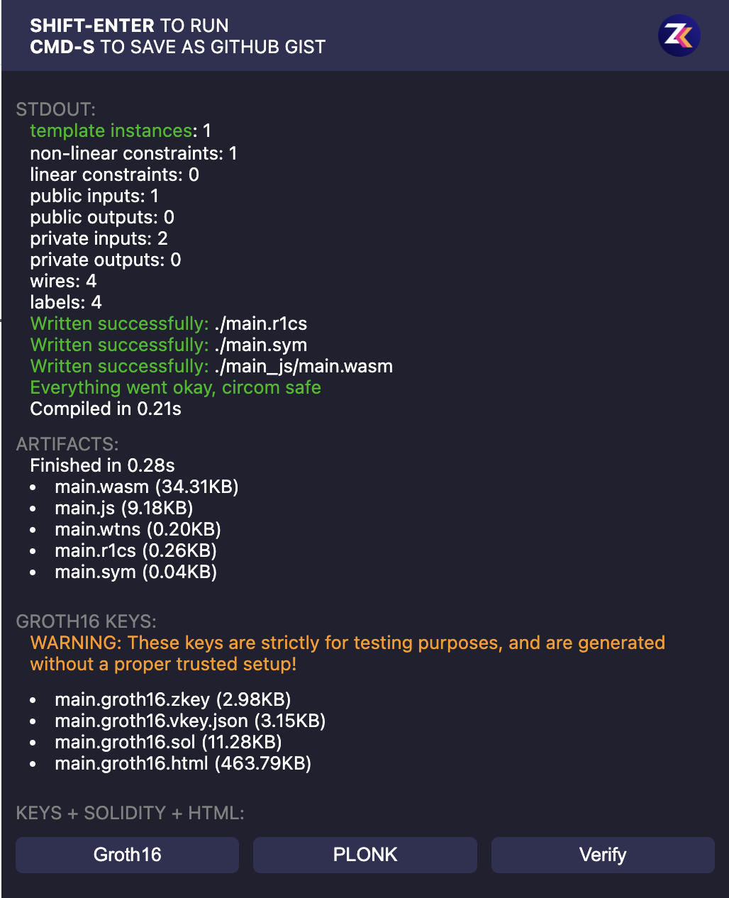
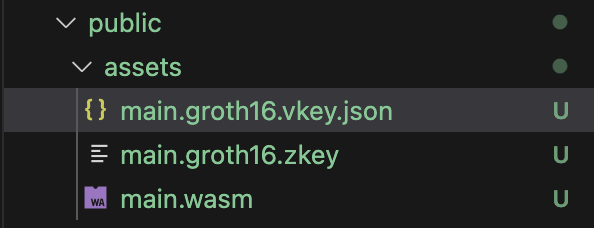
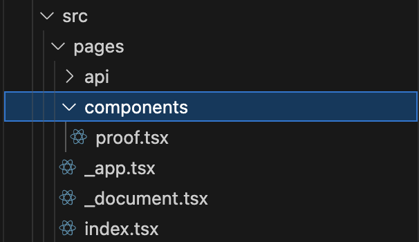
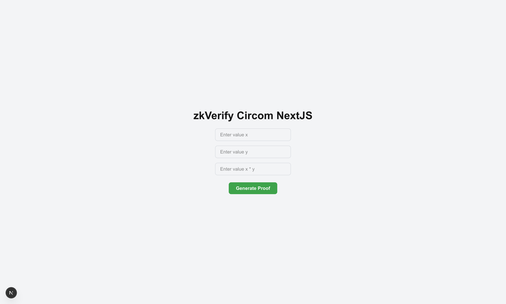
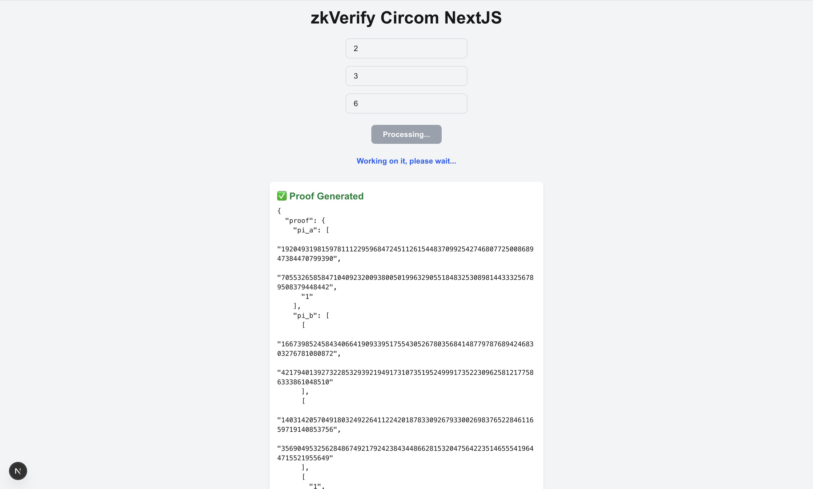
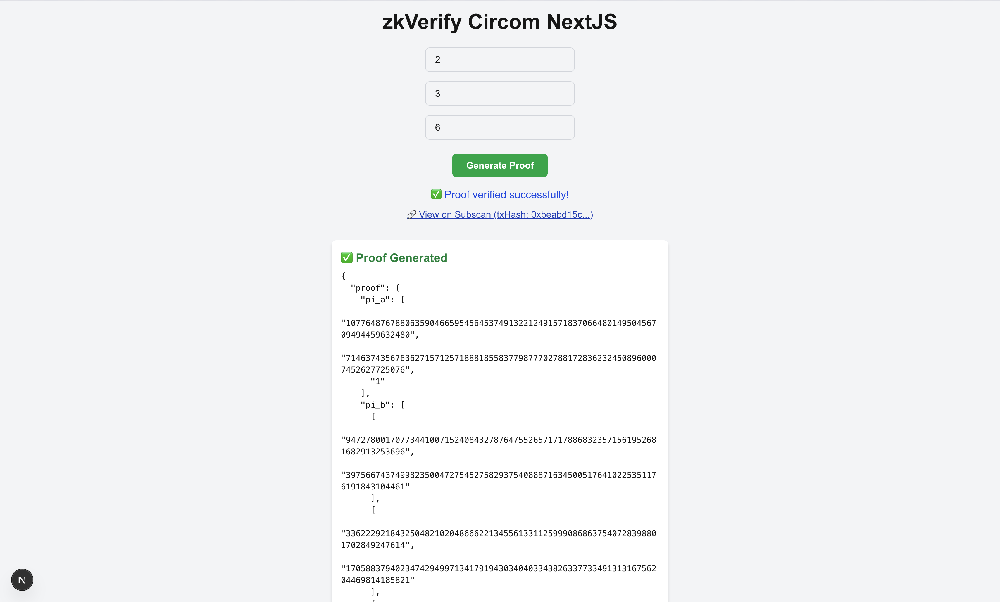

:::info
教程代码可在[此处](https://github.com/zkVerify/tutorials/tree/main/nextjs-circom)查看
:::

本指南演示如何开发一款由 Circom 支持前端生成证明、并通过 [Kurier](../02-getting-started/05-kurier.md) 验证的 NextJS 应用。我们将从零编写简单 `circom` 电路，再用 `snarkjs` 在客户端生成证明。

开始前，使用 [zkRepl](https://zkrepl.dev/) 编写电路（对初学者友好）。不深讲 Circom DSL，只展示必要代码。电路接受三个输入 a、b、c，约束 `c === (a*b)`，可直接使用下方代码：

```circom
pragma circom 2.1.6;


template Example () {
    signal input a;
    signal input b;
    signal input c;

    (a*b) === c;
}

component main { public [ c ] } = Example();

/* INPUT = {
    "a": "5",
    "b": "5",
    "c": "25"
} */
```

粘贴代码后按 `Shift + Enter/Return` 编译电路，点击右侧栏的 `groth16`，下载 `main.wasm`、`main.groth16.zkey`、`main.groth16.vkey.json`。



完成后进入 NextJS 部分。先用命令创建 NextJS 应用：

```bash
npx create-next-app@latest
```

创建过程中会遇到以下选项：

```bash
What is your project named? my-app
Would you like to use TypeScript? No / Yes # Select yes
Would you like to use ESLint? No / Yes # Select yes
Would you like to use Tailwind CSS? No / Yes # Select yes
Would you like your code inside a `src/` directory? No / Yes # Select yes
Would you like to use App Router? (recommended) No / Yes # Select no
Would you like to use Turbopack for `next dev`?  No / Yes # Select yes
Would you like to customize the import alias (`@/*` by default)? No / Yes # Select no
What import alias would you like configured? @/*
```

再安装所需依赖 `axios`、`snarkjs`，先进入项目目录再执行 npm 安装：

```bash
cd your-project-name
```

```bash
npm i axios snarkjs
```

在 IDE 中打开 NextJS 应用，了解目录结构。于 `public` 下创建 `assets` 目录，将此前从 ZKRepl 下载的三个文件复制进去。



在项目根目录创建 `.env` 存放 Kurier API key，后续用于验证：

```bash
API_KEY = "向 Horizen Labs 获取的 API Key"
```

接下来在 NextJS 创建后端 API，接收证明产物并调用 Kurier 验证，供前端使用。于 `api` 子目录新建 `kurier.ts`。

首先引入 axios、snarkjs 等依赖。然后创建处理函数，接受 `POST` 请求，读取请求体中的证明产物进行验证；声明 Kurier 的 `API_URL`，并从 assets 读取 `vkey`。

在提交验证前需注册 verification key（每个 proof 类型一次即可，可降低验证成本）。注册完成后调用 Kurier API 提交 proof 并轮询状态；收到 `IncludedInBlock` 事件即向前端返回交易数据。可参考[Kurier 教程](../02-getting-started/05-kurier.md)。

```ts
import axios from "axios";
import { NextApiRequest, NextApiResponse } from "next";
import fs from "fs";
import path from "path";

const API_URL = "https://api-testnet.kurier.xyz/api/v1";

export default async function handler(
  req: NextApiRequest,
  res: NextApiResponse
) {
  if (req.method !== "POST") {
    return res.status(405).json({ error: "Method not allowed" });
  }

  try {
    if (
      fs.existsSync(
        path.join(process.cwd(), "public", "assets", "vkey.json")
      ) === false
    ) {
      await registerVk();
      await new Promise((resolve) => setTimeout(resolve, 5000));
    }

    const vk = fs.readFileSync(
      path.join(process.cwd(), "public", "assets", "vkey.json"),
      "utf-8"
    );

    const params = {
      proofType: "groth16",
      vkRegistered: true,
      proofOptions: {
        library: "snarkjs",
        curve: "bn128",
      },
      proofData: {
        proof: req.body.proof,
        publicSignals: req.body.publicInputs,
        vk: JSON.parse(vk).vkHash || JSON.parse(vk).meta.vkHash,
      },
    };

    const requestResponse = await axios.post(
      `${API_URL}/submit-proof/${process.env.API_KEY}`,
      params
    );
    console.log(requestResponse.data);

    if (requestResponse.data.optimisticVerify != "success") {
      console.error("Proof verification, check proof artifacts");
      return;
    }

    while (true) {
      try {
        const jobStatusResponse = await axios.get(
          `${API_URL}/job-status/${process.env.API_KEY}/${requestResponse.data.jobId}`
        );
        if (jobStatusResponse.data.status === "IncludedInBlock") {
          console.log("Job Included in Block successfully");
          res.status(200).json(jobStatusResponse.data);
          return;
        } else {
          console.log("Job status: ", jobStatusResponse.data.status);
          console.log("Waiting for job to finalize...");
          await new Promise((resolve) => setTimeout(resolve, 5000)); // Wait for 5 seconds before checking again
        }
      } catch (error: any) {
        if (error.response && error.response.status === 503) {
          console.log("Service Unavailable, retrying...");
          await new Promise((resolve) => setTimeout(resolve, 5000)); // Wait for 5 seconds before retrying
        }
      }
    }
  } catch (error) {
    console.log(error);
  }
}

async function registerVk() {
  const vk = fs.readFileSync(
    path.join(process.cwd(), "public", "assets", "main.groth16.vkey.json"),
    "utf-8"
  );

  const params = {
    proofType: "groth16",
    vk: JSON.parse(vk),
    proofOptions: {
      library: "snarkjs",
      curve: "bn128",
    },
  };

  console.log(params);

  await axios
    .post(`${API_URL}/register-vk/${process.env.API_KEY}`, params)
    .then((response) => {
      console.log("Verification key registered successfully:", response.data);
      fs.writeFileSync(
        path.join(process.cwd(), "public", "assets", "vkey.json"),
        JSON.stringify(response.data)
      );
    })
    .catch((error) => {
      fs.writeFileSync(
        path.join(process.cwd(), "public", "assets", "vkey.json"),
        JSON.stringify(error.response.data)
      );
    });
}
```

在 `src/pages` 下创建 `components` 子目录，用于存放新组件，并在其中新建 `proof.tsx`。



下面细看 proof 组件。先从 `react` 引入 `useState`，从 `snarkjs` 引入 `groth16`。声明多个 state 维护应用状态，再编写 `handleProofGeneration()` 调用 `groth16.fullProve()` 用资产与输入生成 groth16 证明，随后调用前文 Kurier 后端 API 验证并更新状态。`return` 中渲染 UI。

```tsx
"use client";

import { useState } from "react";
import { groth16 } from "snarkjs";

export default function ProofComponent() {
  const [x, setX] = useState("");
  const [y, setY] = useState("");
  const [result, setResult] = useState("");

  const [isLoading, setIsLoading] = useState(false);
  const [proofResult, setProofResult] = useState(null);
  const [errorMsg, setErrorMsg] = useState("");
  const [verificationStatus, setVerificationStatus] = useState("");
  const [txHash, setTxHash] = useState<string | null>(null);

  const handleGenerateProof = async () => {
    setIsLoading(true);
    setProofResult(null);
    setErrorMsg("");
    setVerificationStatus("");
    setTxHash(null);

    try {
      // Generate proof
      const { proof, publicSignals } = await groth16.fullProve(
        { a: x, b: y, c: result },
        "/assets/main.wasm",
        "/assets/main.groth16.zkey"
      );

      setProofResult({ proof, publicSignals });

      // Send to backend for verification
      const res = await fetch("/api/kurier", {
        method: "POST",
        headers: {
          "Content-Type": "application/json",
        },
        body: JSON.stringify({ proof: proof, publicInputs: publicSignals }),
      });

      const data = await res.json();

      if (res.ok) {
        setVerificationStatus("✅ Proof verified successfully!");
        if (data.txHash) {
          setTxHash(data.txHash);
        }
      } else {
        setVerificationStatus("❌ Proof verification failed.");
      }
    } catch (error) {
      console.error("Error generating proof or verifying:", error);
      setErrorMsg(
        "❌ Error generating or verifying proof. Please check your inputs and try again."
      );
    } finally {
      setIsLoading(false);
    }
  };

  return (
    <div className="flex flex-col items-center justify-center min-h-screen bg-gray-100 p-4">
      <h1 className="text-4xl font-bold mb-6">zkVerify Circom NextJS</h1>

      {/* Inputs */}
      <div className="flex flex-col space-y-4 w-64 mb-6">
        <input
          type="number"
          placeholder="Enter value x"
          value={x}
          onChange={(e) => setX(e.target.value)}
          className="px-4 py-2 rounded-lg border border-gray-300 focus:outline-none focus:ring-2 focus:ring-blue-500"
        />
        <input
          type="number"
          placeholder="Enter value y"
          value={y}
          onChange={(e) => setY(e.target.value)}
          className="px-4 py-2 rounded-lg border border-gray-300 focus:outline-none focus:ring-2 focus:ring-blue-500"
        />
        <input
          type="number"
          placeholder="Enter value x * y"
          value={result}
          onChange={(e) => setResult(e.target.value)}
          className="px-4 py-2 rounded-lg border border-gray-300 focus:outline-none focus:ring-2 focus:ring-blue-500"
        />
      </div>

      {/* Generate Proof Button */}
      <button
        onClick={handleGenerateProof}
        disabled={isLoading}
        className={`${
          isLoading
            ? "bg-gray-400 cursor-not-allowed"
            : "bg-green-600 hover:bg-green-700"
        } text-white font-semibold px-6 py-2 rounded-lg`}
      >
        {isLoading ? "Processing..." : "Generate Proof"}
      </button>

      {/* Loading */}
      {isLoading && (
        <div className="mt-6 text-blue-600 font-semibold">
          Working on it, please wait...
        </div>
      )}

      {/* Error Message */}
      {errorMsg && (
        <div className="mt-6 text-red-600 font-medium">{errorMsg}</div>
      )}

      {/* Verification Result */}
      {verificationStatus && (
        <div className="mt-4 text-lg font-medium text-blue-700">
          {verificationStatus}
        </div>
      )}

      {/* TX Hash */}
      {txHash && (
        <div className="mt-2 text-blue-800 underline">
          <a
            href={`https://zkverify-testnet.subscan.io/extrinsic/${txHash}`}
            target="_blank"
            rel="noopener noreferrer"
          >
            🔗 View on Subscan (txHash: {txHash.slice(0, 10)}...)
          </a>
        </div>
      )}

      {/* Output */}
      {proofResult && (
        <div className="mt-8 bg-white shadow-md p-4 rounded-lg w-full max-w-xl">
          <h2 className="text-xl font-bold mb-2 text-green-700">
            ✅ Proof Generated
          </h2>
          <pre className="text-sm overflow-x-auto whitespace-pre-wrap break-words">
            {JSON.stringify(proofResult, null, 2)}
          </pre>
        </div>
      )}
    </div>
  );
}
```

打开 `index.tsx` 引入 proof 组件，替换为：

```tsx
import Image from "next/image";
import { Geist, Geist_Mono } from "next/font/google";
import ProofComponent from "./components/proof";

const geistSans = Geist({
  variable: "--font-geist-sans",
  subsets: ["latin"],
});

const geistMono = Geist_Mono({
  variable: "--font-geist-mono",
  subsets: ["latin"],
});

export default function Home() {
  return (
    <>
      <ProofComponent />
    </>
  );
}
```

至此 NextJS 应用已就绪，运行：

```bash
npm run dev
```

在终端提供的地址访问，界面如下：



输入任意 x、y、result（满足 `result = x*y`），点击 `Generate Proof`。生成后会显示在按钮下方：



生成后会自动通过 Kurier 提交验证并显示 “working on it”。验证通过后会返回 txHash，可点击在 Explorer 查看。


